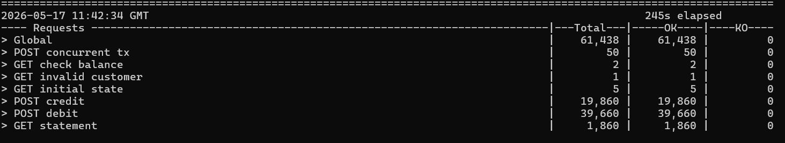
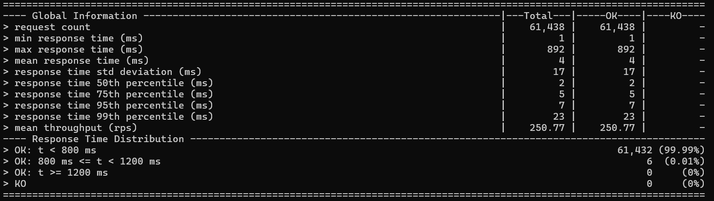

## Account Transactions with Controlled Concurrency 

Hochperformante API zur Verarbeitung von Finanztransaktionen, entwickelt mit .NET 10 Minimal API, PostgreSQL und Nginx als Load Balancer.


## Inhaltsverzeichnis
 
- [Architektur](#architektur)
- [Technologie-Stack](#technologie-stack)
- [Ergebnis des Lasttests](#ergebnis-des-lasttests)
- [Voraussetzungen](#voraussetzungen)
- [Schnellstart](#schnellstart)
- [Endpunkte](#endpunkte)
  - [POST /customers/{id}/transactions](#post-customersidtransactions)
  - [GET /customers/{id}/statement](#get-customersidstatement)
- [Behandlung gleichzeitiger Transaktionen](#behandlung-gleichzeitiger-transaktionen)
  - [Das Problem: Lost Update und Limit-Überschreitung](#das-problem-lost-update-und-limit-überschreitung)
  - [Die Lösung: Atomares UPDATE in PostgreSQL](#die-lösung-atomares-update-in-postgresql)
  - [Warum kein SERIALIZABLE oder explizites Locking nötig ist](#warum-kein-serializable-oder-explizites-locking-nötig-ist)
  - [Validierung durch den Gatling-Lasttest](#validierung-durch-den-gatling-lasttest)
- [Entwurfsentscheidungen](#entwurfsentscheidungen)
  - [SQL-Befehlspool](#sql-befehlspool)
  - [Npgsql-Multiplexing](#npgsql-multiplexing)
  - [Abgestimmte Ressourcenlimits](#abgestimmte-ressourcenlimits)
- [PostgreSQL-Optimierungen](#postgresql-optimierungen)
- [Debugging-Verlauf](#debugging-verlauf)
- [Projektstruktur](#projektstruktur)
- [Lizenz](#lizenz)


---
 

## Architektur

<p align="center">
  
</p>


## Technologie-Stack

- [.NET 8](https://dotnet.microsoft.com/) — Minimal API mit `WebApplication.CreateSlimBuilder`
- [Npgsql](https://www.npgsql.org/) — PostgreSQL-Treiber mit Connection Pool und Multiplexing
- [PostgreSQL 16](https://www.postgresql.org/)
- [Nginx](https://nginx.org/) — Reverse Proxy und Load Balancer
- [Docker Compose](https://docs.docker.com/compose/)
- [Gatling](https://gatling.io/) — Lasttest via Scala-Skript
---

## Ergebnis des Lasttests
<p align="center">
  
  
</p>

---

## Voraussetzungen
 
- Docker Engine (oder Docker Desktop) mit WSL2-Unterstützung
- Java 11+ (für Gatling)
- [Gatling 3.x](https://gatling.io/open-source/) lokal oder via Maven installiert

## Schnellstart
 
### 1. Infrastruktur starten
 
```bash
docker compose up --build
```

### 2. Container prüfen
 
```bash
docker compose ps
docker compose logs api01 api02
```
 
In den Logs sollte erscheinen:
```
CreditPool ready: 50 commands
DebitPool ready: 50 commands
StatementPool ready: 50 commands
```
---
 
## Endpunkte
 
### `POST /customers/{id}/transactions`
 
Bucht eine Gutschrift oder Abbuchung auf dem Kundenkonto.
 
**Pfadparameter:** `id` — Ganzzahl zwischen 1 und 5.
 
**Body:**
```json
{
  "amount": 1000,
  "type": "c",
  "description": "einzahlung"
}
```
 
| Feld | Typ | Regeln |
|---|---|---|
| `amount` | positive Ganzzahl | > 0, keine Dezimalstellen |
| `type` | char | `"c"` (Gutschrift) oder `"d"` (Abbuchung) |
| `description` | string | 1–10 Zeichen |
 
**Antwort 200:**
```json
{ "limit": 100000, "balance": -2500 }
```
 
**422** wenn die Abbuchung das Limit überschreitet, der Kunde nicht existiert oder der Payload ungültig ist.
 
---
 
### `GET /customers/{id}/statement`
 
Gibt den aktuellen Kontostand und die letzten 10 Transaktionen zurück.
 
**Antwort 200:**
```json
{
  "balance": {
    "total": -2500,
    "limit": 100000,
    "date_statement": "2024-01-17T18:36:22.123Z"
  },
  "last_transactions": [
    {
      "amount": 1000,
      "type": "c",
      "description": "einzahlung",
      "created_at": "2024-01-17T18:36:22.123Z"
    }
  ]
}
```
 
---

## Behandlung gleichzeitiger Transaktionen
 
Dies ist der anspruchsvollste Teil des Systems. Unter hoher Last treffen Hunderte von Abbuchungen und Gutschriften gleichzeitig für dasselbe Konto ein — ohne korrekte Behandlung entstehen Race Conditions, die zu falschen Kontoständen oder zur stillen Überschreitung des Kreditlimits führen.
 
### Das Problem: Lost Update und Limit-Überschreitung
 
Angenommen, Kunde 1 hat einen Kontostand von `-980` und ein Limit von `1000` (d. h. er darf maximal bis `-1000` gehen). Zwei Abbuchungen von je `30` treffen gleichzeitig ein. Ohne atomare Operationen entsteht das klassische **Lost-Update-Problem**:
 
```
Thread A liest:   balance = -980
Thread B liest:   balance = -980   ← liest denselben veralteten Wert
 
Thread A prüft:   -980 - 30 = -1010  →  überschreitet -1000  →  ablehnen ✓
Thread B prüft:   -980 - 30 = -1010  →  überschreitet -1000  →  ablehnen ✓
```
 
Soweit korrekt. Aber bei kleineren Beträgen, die beide noch ins Limit passen:
 
```
Thread A liest:   balance = -980
Thread B liest:   balance = -980   ← noch der alte Wert
 
Thread A prüft:   -980 - 15 = -995  ≥ -1000  →  akzeptieren
Thread B prüft:   -980 - 15 = -995  ≥ -1000  →  akzeptieren  ← basiert auf veraltetem Wert!
 
Thread A schreibt: balance = -995
Thread B schreibt: balance = -995   ← überschreibt A, eine Buchung geht verloren!
```
 
Beide Transaktionen werden akzeptiert und bestätigt, aber nur eine landet im Kontostand. Die andere Abbuchung ist still verschwunden — ein kritischer Datenfehler in einem Finanzsystem.
 
### Die Lösung: Atomares UPDATE in PostgreSQL
 
Statt die Prüfung in der Anwendungsschicht durchzuführen, verlagert das System die gesamte Logik in **eine einzige atomare SQL-Anweisung**:
 
```sql
WITH updated AS (
    UPDATE customer
       SET balance = balance - @amount
     WHERE id = @id
       AND balance - @amount >= -"limit"  -- Limitprüfung direkt im UPDATE
     RETURNING balance, "limit"
),
ins AS (
    INSERT INTO transactions (amount, description, type, customer_id)
    SELECT @amount, @description, @type, @id
      FROM updated                        -- INSERT nur wenn UPDATE erfolgreich war
)
SELECT balance, "limit" FROM updated;
```
 
**Warum das funktioniert — Row-Level Locking:**
 
PostgreSQL setzt beim `UPDATE` einer Zeile automatisch eine **Zeilensperre (Row-Level Lock)**. Treffen 25 gleichzeitige Abbuchungen ein, werden sie von PostgreSQL serialisiert — jede Transaktion wartet auf die Freigabe der Sperre durch die vorherige:
 
```
Transaktion 1: LOCK Zeile → liest balance=-980 → -980-15=-995 ≥ -1000 ✓ → schreibt -995 → UNLOCK
Transaktion 2:  (wartet…) → LOCK Zeile → liest balance=-995 → -995-15=-1010 < -1000 ✗ → kein UPDATE → UNLOCK → 0 Zeilen zurück → HTTP 422
Transaktion 3:  (wartet…) → LOCK Zeile → liest balance=-995 → -995-15=-1010 < -1000 ✗ → kein UPDATE → …
```
 
Gibt das `UPDATE` keine Zeilen zurück (`hasRows == false`), antwortet die API mit **HTTP 422** — die Transaktion wird sauber abgelehnt, ohne dass eine inkonsistente Buchung entsteht.
 
**Atomarität von Buchung und Transaktionseintrag:**
 
Die gesamte Operation — Kontostand prüfen, aktualisieren und den Transaktionseintrag anlegen — findet in **einem einzigen Datenbankaufruf** statt. Es gibt keinen Zeitpunkt, an dem der Kontostand bereits aktualisiert wurde, aber der Transaktionseintrag noch fehlt. Entweder beides oder nichts — das `INSERT` ist über `FROM updated` direkt an das Ergebnis des `UPDATE` gebunden.

### Validierung durch den Gatling-Lasttest
 
Der Test enthält eine dedizierte Concurrency-Validierungsphase, die genau dieses Szenario prüft:
 
```scala
// Phase 1: 25 gleichzeitige Abbuchungen von je 1 auf Kunde 1
concurrentTransactions("d").inject(atOnceUsers(25))
  .andThen(
    // Erwarteter Kontostand: -25 (alle 25 mussten durchgehen, kein Lost Update)
    checkBalance(-25).inject(atOnceUsers(1))
  ).andThen(
    // Phase 2: 25 gleichzeitige Gutschriften von je 1
    concurrentTransactions("c").inject(atOnceUsers(25))
      .andThen(
        // Erwarteter Kontostand: 0 (exakt ausgeglichen)
        checkBalance(0).inject(atOnceUsers(1))
      )
  )
```
 
Das Ergebnis `checkBalance(-25) ` und `checkBalance(0) ` beweist:
- Kein einziger Wert ging verloren (kein Lost Update)
- Alle 25 Abbuchungen wurden korrekt serialisiert
- Alle 25 Gutschriften haben den Kontostand exakt wieder ausgeglichen
---
 
## Entwurfsentscheidungen
 
### SQL-Befehlspool
 
Die Klassen `AccountCreditPool`, `AccountDebitPool` und `AccountStatementPool` halten eine Warteschlange (`ConcurrentQueue`) von vorbereiteten `NpgsqlCommand`-Objekten. Dies eliminiert den Allokations- und Kompilierungsaufwand pro Anfrage.
 
```
Anfrage ──▶ GetCommand() ──▶ [Parameter setzen] ──▶ ExecuteReader ──▶ ReturnCommand()
               │ Pool leer?                                                │
               └──▶ Create() (neuer Befehl)        Befehl zurück ─────────┘
                                                   in sauberem Zustand
```
 
> **Wichtig:** Beim Zurückgeben an den Pool wird nur der `.Value` der Parameter zurückgesetzt — das `NpgsqlParameter`-Objekt mit seinem Namen (`@amount`, `@id` usw.) bleibt erhalten, damit das Named-Parameter-Binding bei der nächsten Ausführung korrekt funktioniert.

### Npgsql-Multiplexing
 
Die Connection String verwendet `Multiplexing=true`. Dadurch können mehrere asynchrone Operationen dieselbe physische Verbindung gemeinsam nutzen, was den Durchsatz unter hoher Nebenläufigkeit deutlich steigert, ohne mehr Verbindungen zum PostgreSQL-Server zu benötigen.
 
### Abgestimmte Ressourcenlimits
 
| Container | CPU | RAM | Begründung |
|---|---|---|---|
| db | 0,4 | 220 MB | `shared_buffers=96MB` < Container-Limit |
| api01 / api02 | 0,4 | 115 MB | Pool von 50 Befehlen + Npgsql max. 50 Verbindungen |
| nginx | 0,3 | 100 MB | Statischer Proxy, kein Zustand |
 
`shared_buffers` muss immer kleiner sein als das Speicherlimit des Containers — andernfalls beendet der Kernel-OOM-Killer den Postgres-Prozess unter Last.
 
---

## PostgreSQL-Optimierungen
 
```
shared_buffers=96MB        # Seiten-Cache im Arbeitsspeicher
max_connections=150        # 2 APIs × 50 max. Verbindungen + Reserve
fsync=off                  # kein Disk-Flush nach jedem Commit (Testumgebung)
full_page_writes=off       # reduziert WAL in der Testumgebung
synchronous_commit=off     # Commit ohne Warten auf Disk-Bestätigung
work_mem=2MB               # Arbeitsspeicher pro Sort-/Hash-Operation
```

---
 
## Projektstruktur
 
```
.
├── AccountTransactionsProcessor/
│   ├── Program.cs                  # Endpunkte und Konfiguration
│   ├── Pools/
│   │   ├── AccountCreditPool.cs    # Befehlspool für Gutschriften
│   │   ├── AccountDebitPool.cs     # Befehlspool für Abbuchungen
│   │   ├── AccountStatementPool.cs # Befehlspool für Kontoauszüge
│   │   └── PoolStartup.cs          # Aufwärmen der Pools beim Start
│   ├── Dtos/                       # Request-/Response-Modelle
│   └── appsettings.json
├── Docs/
├── Loadtest/
│   └── BackendAccountTransactionsSimulation.scala
├── Sql/
│   └── ddl.sql                     # Datenbankschema + initiale Kundendaten
├── docker-compose.yml
├── nginx.conf
└── README.md
```
 
---
## Lizenz
MIT

Inspiriert von der Backend-Herausforderung: [Rinha de Backend](https://github.com/zanfranceschi/rinha-de-backend-2024-q1)
